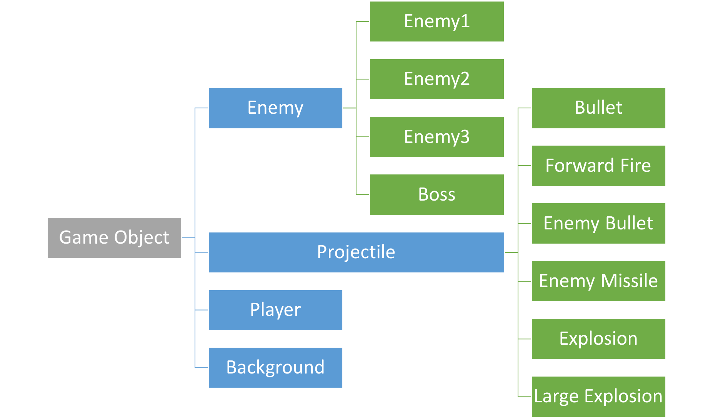

# ShootGame
这是一个纵版飞行射击游戏，玩家操控飞机射击并且消灭敌人，最后消灭boss整个关卡就结束了。

## 游戏名称

未定

## 团队信息

### 成员

秦雨轩 何昊 李天翼 缪舜 潘兴禄 王乐强  

### 分工

何昊：游戏的底层实现和架构设计，代码的评审、整合和重构

李天翼：开始，结束和暂停界面的设计，保存和读取游戏功能的实现

王乐强：场景管理器的设计，设计整个游戏关卡

秦雨轩、缪舜、潘兴禄：玩家和敌人类的设计，包括投射物的设计

## 底层架构

负责人：何昊


设计游戏的底层架构是一件非常具有挑战性的事情，因为游戏各个模块之间关联性非常大，稍加不慎代码就会乱成一团。此外，游戏又经常需要往各种五花八门的方向扩展，这就使得我们设计时要非常小心。如果可扩展性太强，则代码难以阅读、维护和编写；但是要是太弱，又使得代码不灵活，新需求出现时常常需要重构。因此我必须寻找一个适合我们需求的平衡点。考虑我们游戏的实现需求，我们将游戏划分成上图所示的模块。每个模块可以由一个人或多个人维护，模块与模块之间耦合度低，可以由不同人完成。这样我们就能很好地完成分工。

### 游戏物件设计

对所有的游戏物件，我们都为其设计了三个方法供子类重载，类似如下：

```java
public abstract class GameObject {
    public void update() {}
    public void render(Graphics g) {}
    public void onCollision(Collider other) {}
}
```

`update()`在游戏主循环里调用，负责更新这个物件在下一帧的状态，例如，是该移动，还是该射击，还是该死亡，等等。如果要处理用户输入，则可以在`update()`中调用`InputManager.getInput()`方法。

`render()`在`JPanel`的`paint()`方法里被调用，负责这个游戏物件的渲染。比如绘制图片，绘制血条，绘制动画，等等。如果要使用各种图片，则调用`ResourceManager.getImage()`方法。

`onCollision()`则是在这个游戏物件的`Collider`不为`null`，在物理引擎检测碰撞时发现了碰撞而调用，可以用来处理物体与物体之间的交互关系，例如子弹命中敌人该怎么做，玩家和敌人碰撞该怎么做，等等。一个典型的游戏物件设计类似如下：

``` java
public class SomeObject extends GameObject {
    // Some Private Fields Here
    // Some Initalization Here
    public void update() {
        HandlePlayerInput();
        Move();
        ShootBullet();
        ShootMissile();
    }
    public void render(Graphics g) {
    	g.DrawImage(image, ..., ..., ..., ...);
    }
    public void onCollision(Collider other) {
        if (other instanceof Projectile) {
            // Do Something
        } else if (other instanceof Enemy) {
            // Do Something
        }
    }
}
```

游戏物件的继承树如下：



这样，对于负责编写游戏物件的人，就不用触碰游戏底层的代码，只用编写和扩展以上三个函数就能实现绝大多数的游戏功能。

### 游戏主循环

任何游戏都需要一个主循环，在主循环中按固定的间隔刷新游戏，在不同的模块中调用上述的`update()，render()`和`onCollision()`方法，让物体移动，子弹爆炸， 敌人攻击……这样一帧一帧下去，整个游戏便运转了起来。我们的游戏主循环形如

```java
timer.schedule(new TimerTask() {
    if (state == RUNNING) {
        updateTimeInformation();
        handleUserInput();
        for (object : gameObjects)
            object.update();
        physicsEngine.detectCollision();
        garbageCollection();
        checkGameOver();
    }
    repaint();
}, interval, interval);
```

主循环中，如果游戏正在运行，每一帧先更新时序信息，然后处理用户输入，然后对所有游戏物件更新游戏状态，然后处理物理引擎，然后回收这一帧被摧毁的游戏物体，然后检查游戏是否结束，最后调用渲染线程对画面进行渲染。

### 关于成员变量的可访问性

一般来讲，在面向对象的软件设计中，为了良好的封装，都会将成员变量设为`private`并提供`getter()`和`setter()`方法，但是游戏程序中有时并不会这么做，原因如下：

1. 游戏的模块与模块之间耦合度高，常常出现一个模块大量访问另一个模块的情况，这时使用`getter()`和`setter()`方法会使得代码没有必要地冗长。
2. 由于这种调用非常多，`getter()`和`setter()`会产生可观的函数调用开销，其中尤其致命的是大量地址波动较大的内存访问，是对程序局部性的破坏，降低缓存性能。对于一般应用这种性能损失可以忽略不计，但对性能要求较高的游戏程序则不一定可以忽略。
3. 在Unity等成熟商业游戏引擎中，也存在大量模块直接提供大量`public`成员供程序员直接访问，体现出这是业界的最佳实践。
4. 有的成员变量，即使在外部做了任意修改也不一定会破坏整个游戏的运行正确性。例如，这个变量会在每次游戏主循环中被一段固定代码刷新。

综上所述，本游戏程序的设计中，如果某些变量需要大量修改并且对其修改不会破坏游戏的状态，则会将其暴露为`public`，不提供`getter()`和`setter()`。而对于对游戏状态的正确性确实很敏感的变量，设置为`private`，并且也不提供`getter()`和`setter()`，只允许其他`public`方法更新其值。


## 游戏机制

### 玩家设计:


玩家类继承GameObject类，主要通过键盘来控制上下左右的移动,并且会不断地发射主武器子弹来打击敌人并充能,同时根据充能情况通过键盘发射特殊技能.这部分主要在玩家的updata函数中调用inputManager类中的方法实现：

``` java
    @Override
    public void update() {
        //根据不同按键移动
        if (game.inputManager.getInput(...)) ...
        ...
        
        // 技能充能
        if (rowShootEnergy < ROW_SHOOT_CHARGE_TIME) ...
        if (forwardFireEnergy < FORWARD_FIRE_CHARGE_TIME) ...
        
        /**按Z键发射一行子弹*/
        if (game.inputManager.getInput(InputManager.Key.Z) && rowShootEnergy >= ROW_SHOOT_CHARGE_TIME) ...
        
        /**按X键喷火*/
        if (game.inputManager.getInput(InputManager.Key.X) && forwardFireEnergy >= FORWARD_FIRE_CHARGE_TIME) ...
        
        // 检查玩家是否移出边界
        if (x <= 0)...
        else if ((x + width) >= ShootGame.WIDTH) ...
        if (y <= 0) ...
        else if (y >= ShootGame.HEIGHT) ...
        
        // 固定间隔发射主武器
        long shootInterval = 300; // 射击间隔
        if (game.currentTime - lastShotTime >= shootInterval)...
    }
```

同时玩家会有碰撞检测和生成图片的方法：

``` java
 @Override
 public void onCollision(GameObject other) {...}
 
 Override
 public void render(Graphics g) {
        g.drawImage(image, getX(), getY(), width,height, null);
  }
```

玩家的主武器：直线射击的子弹


``` java
private Bullet[] shoot(){...}
```
技能一：射出大范围一屏幕子弹（范围大伤害低）

<div style="float:left;border:solid 1px 000;margin:2px;">


<div>
    
``` java
private Bullet[] rowshoot(){...}
```

技能二：发射一个持续高伤害的火球（范围小伤害高）


``` java
private ForwardFire[] forwardfire(){...}
```

### 敌人设计：

对于敌人类的设计,主要想通过对武器,速度,体积等因素的不同设置，设计出几种不同种类的敌人，使得游戏场景更加丰富一些。
敌人类Enemy继承自GameObject,在updata()函数中进行相应的行动设置,同样有onCollision()碰撞检测,render()生成图像.
具体的敌人类继承自Enemy类,它们的特定如下:

#### 敌人一(Enemy1)：


HP：一枪就死

武器：没有

体积：小

速度：快

伤害方式：碰到玩家自爆并赋予伤害

#### 敌人二(Enemy2)：


HP：5（血量适中）

武器：会隔一段时间射出一个子弹

``` java
private EnemyBullet[] shootBullet(){...}
```

体积：中等

速度：中等

碰到玩家也会自爆并赋予伤害

#### 敌人三(Enemy3)：


HP：15（比较高)

武器：既有子弹又会射导弹

<div style="float:left;border:solid 1px 000;margin:2px;">
  子弹
  导弹
<div>
    
``` java
private EnemyBullet[] shootBullet(){...}
private EnemyMissile[] shootMissile(){...}
```
体积：大

速度：慢

不流动，只会在画面上方左右晃，碰到玩家什么都不会发生

#### BOSS


HP：非常高

技能：会发射导弹

``` java
private EnemyMissile[] shootMissile(){...}
```

操作：随机左右移动

BOSS仅在上半屏幕活动


#### 投射物

<div>  导弹<div>

#### 敌人管理器

怎么控制敌人出来

## 游戏画面

### 精灵动画


1. 子弹命中时的爆炸效果（小）
``` java
private Explosion[] explode(double x, double y){...}
```
2. 敌人死亡时的爆炸效果（大）
``` java
private LargeExplosion[] explode(double x, double y, int width, int height) {...}
```

#### 开始界面

单独的JFrame窗体，要有开始，选项，帮助，退出等功能，开始游戏后调出主游戏的JPanel

#### 暂停界面

一个浮在游戏上方的JPanel，提供退出，回到游戏主界面等功能

#### 结束界面

单独的JFrame窗体，显示玩家的分数和杀敌数，评价等信息，点击返回回到开始界面
### 开发中遇到的问题

#### 如何灵敏地处理键盘输入

Java自带的`KeyAdapter`的实时性非常差。

#### 如何很好地管理大量图片资源

#### 如何初始化射出的子弹的位置,使得效果更加逼真

java图片的位置设置要手动设置,如果设置得不合理的话显示效果比较差

### 参考资料

1. Unity Game Engine.
2. Robert Nystrom. Game Programming Patterns. China Posts & Telecom Press. 2016.
3. Jason Gregory. Game Engine Architecture. Publishing House of Electronic Industry. 2015.
