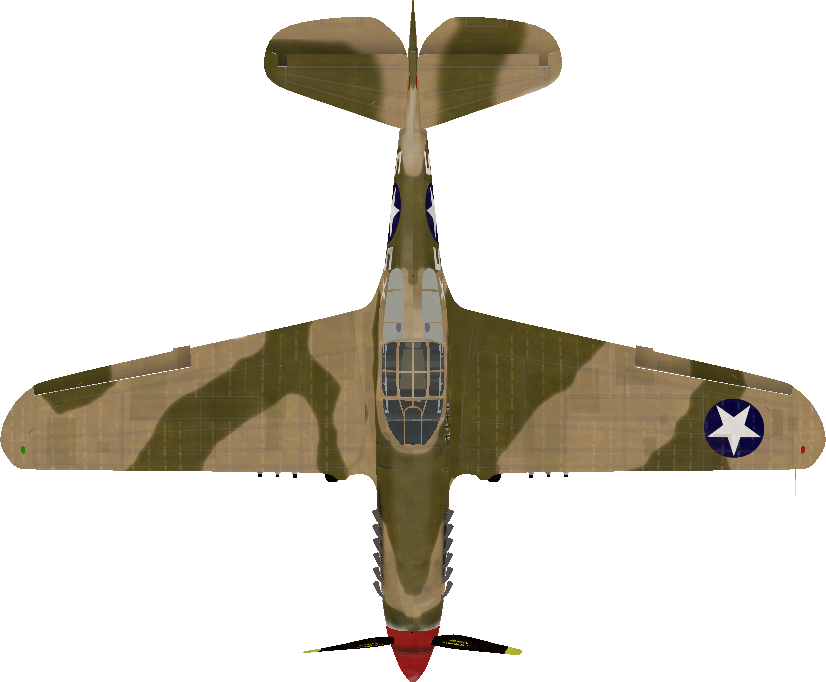

# Shoot! Game
这是一个纵版飞行射击游戏，玩家操控飞机射击并且消灭敌人，最后消灭boss整个关卡就结束了。

## 1. 游戏名称

## Shoot! Game

## 2. 团队信息

### 2.1 成员

秦雨轩 何昊 李天翼 缪舜 潘兴禄 王乐强  

### 2.2 分工

何昊：游戏的底层实现和架构设计，代码的评审、整合和重构

李天翼：开始，结束和暂停界面的设计，保存和读取游戏功能的实现

王乐强：场景管理器的设计，设计整个游戏关卡

秦雨轩、缪舜、潘兴禄：玩家和敌人类的设计，包括投射物的设计

## 3. 底层架构

负责人：何昊


考虑我们游戏的实现需求，我们将游戏划分成上图所示的模块。每个模块可以由一个人或多个人维护，模块与模块之间耦合度低，可以由不同人完成。这样我们就能很好地完成分工。游戏分为以下部分：核心类`ShootGame`，开始和结束游戏的窗体类，还有游戏上层场景。在场景中存在各种各样的`GameObject`来实现整个游戏的功能。游戏核心类`ShootGame`还负责和其他类进行通讯。

### 3.1 游戏物件设计

对所有的游戏物件，我们都为其设计了三个方法供子类重载，类似如下：

```java
public abstract class GameObject {
    public void update() {}
    public void render(Graphics g) {}
    public void onCollision(Collider other) {}
}
```

`update()`在游戏主循环里调用，负责更新这个物件在下一帧的状态，例如，是该移动，还是该射击，还是该死亡，等等。如果要处理用户输入，则可以在`update()`中调用`InputManager.getInput()`方法。

`render()`在`JPanel`的`paint()`方法里被调用，负责这个游戏物件的渲染。比如绘制图片，绘制血条，绘制动画，等等。如果要使用各种图片，则调用`ResourceManager.getImage()`方法。

`onCollision()`则是在这个游戏物件的`Collider`不为`null`，在物理引擎检测碰撞时发现了碰撞而调用，可以用来处理物体与物体之间的交互关系，例如子弹命中敌人该怎么做，玩家和敌人碰撞该怎么做，等等。一个典型的游戏物件设计类似如下：

``` java
public class SomeObject extends GameObject {
    // Some Private Fields Here
    // Some Initalization Here
    public void update() {
        HandlePlayerInput();
        Move();
        ShootBullet();
        ShootMissile();
    }
    public void render(Graphics g) {
    	g.DrawImage(image, ..., ..., ..., ...);
    }
    public void onCollision(Collider other) {
        if (other instanceof Projectile) {
            // Do Something
        } else if (other instanceof Enemy) {
            // Do Something
        }
    }
}
```

游戏物件的继承树如下：


这样，对于负责编写游戏物件的人，就不用触碰游戏底层的代码，只用编写和扩展以上三个函数就能实现绝大多数的游戏功能。

### 3.2 游戏主循环

任何游戏都需要一个主循环，在主循环中按固定的间隔刷新游戏，在不同的模块中调用上述的`update()，render()`和`onCollision()`方法，让物体移动，子弹爆炸， 敌人攻击……这样一帧一帧下去，整个游戏便运转了起来。我们的游戏主循环形如

```java
timer.schedule(new TimerTask() {
    if (state == RUNNING) {
        updateTimeInformation();
        handleUserInput();
        for (object : gameObjects)
            object.update();
        physicsEngine.detectCollision();
        garbageCollection();
        checkGameOver();
    }
    repaint();
}, interval, interval);
```

主循环中，如果游戏正在运行，每一帧先更新时序信息，然后处理用户输入，然后对所有游戏物件更新游戏状态，然后处理物理引擎，然后回收这一帧被摧毁的游戏物体，然后检查游戏是否结束，最后调用渲染线程对画面进行渲染。

### 3.3 关于成员变量的可访问性

一般来讲，在面向对象的软件设计中，为了良好的封装，都会将成员变量设为`private`并提供`getter()`和`setter()`方法，但是游戏程序中有时并不会这么做，原因如下：

1. 游戏的模块与模块之间耦合度高，常常出现一个模块大量访问另一个模块的情况，这时使用`getter()`和`setter()`方法会使得代码没有必要地冗长。
2. 由于这种调用非常多，`getter()`和`setter()`会产生可观的函数调用开销，其中尤其致命的是大量地址波动较大的内存访问，是对程序局部性的破坏，降低缓存性能。对于一般应用这种性能损失可以忽略不计，但对性能要求较高的游戏程序则不一定可以忽略。
3. 在Unity等成熟商业游戏引擎中，也存在大量模块直接提供大量`public`成员供程序员直接访问，体现出这是业界的最佳实践。
4. 有的成员变量，即使在外部做了任意修改也不一定会破坏整个游戏的运行正确性。例如，这个变量会在每次游戏主循环中被一段固定代码刷新。

综上所述，本游戏程序的设计中，如果某些变量需要大量修改并且对其修改不会破坏游戏的状态，则会将其暴露为`public`，不提供`getter()`和`setter()`。而对于对游戏状态的正确性确实很敏感的变量，设置为`private`，并且也不提供`getter()`和`setter()`，只允许其他`public`方法更新其值。

### 3.4 开发中遇到的问题

#### 3.4.1 如何灵敏地处理键盘输入

Java自带的`KeyListener/KeyAdapter`的实时性非常差。如果直接使用`KeyAdapter`中的`KeyPressed`等方法，大概只能每0.几秒响应一次，完全无法做到流畅的飞机控制。

因此，为了实现游戏的即时性，我们必须使用更加底层的API，自己设计另一种模式的用户输入才行。因此，我们设计了一个`InputManager类来处理用户输入。`在`JFrame`中，我们可以自定义其`InputMap`和`ActionMap`，对每一种按键定义一个`KeyStroke`，将其绑定到`InputMap`和`ActionMap`上，然后在`InputManager`类中实现一张表，存储当前帧被监听的按键是被按下了还是被松开了。这样，我们就可以在游戏主循环中直接调用`InputManager`的接口获取一个按键是否被按下的信息，实现非常流畅的键盘响应。这种输入线程只负责维护一张表，在游戏主线程中处理用户输入的方式在游戏中非常常用。

伪代码如下：

``` java
public class InputManager {
    public enum Key {
        LEFT("Left", KeyEvent.VK_LEFT),
        RIGHT("Right", KeyEvent.VK_RIGHT),
        UP("Up", KeyEvent.VK_UP),
        DOWN("Down", KeyEvent.VK_DOWN),
        // ... More Key Bindings and Methods
    }
    private Map<Key, Boolean> dirMap = new EnumMap<>(Key.class);
    public boolean getInput(Key key) { 
        // Access dirMap
    }
    private void setKeyBindings() {
        // Bind DirAction with KeyStroke
    }
    private class DirAction extends AbstractAction {
        @Override
        public void actionPerformed(ActionEvent evt) {
            // Update dirMap using event info
        }
    }
}
```

#### 3.4.2 如何很好地管理大量图片资源

我们在编程的过程中会涉及到大量的图片文件，如何组织这些图片文件是个很大的问题。为了打包成`jar`文件的时的美观，我们必须将图片文件打包进`jar`文件中。为了实现这一点，必须使用`class.getResource(URL url)`方法。

此外，为了让所有人都可以方便地添加、删除各种图片，我们设计了一个`ResourceManager`类，在这个类中可以包装一个接口，在程序开始时预读取所有图片文件，每个图片文件标记一个唯一的`tag`，各个`GameObject`获取资源时直接根据`tag`读取指针即可。如果`GameObject`请求不到资源，可以返回一个占位符图片而不至于使得整个游戏因为缺失资源而崩溃。

伪代码如下

```java
public class ResourceManager {
    private static HashMap<String, BufferedImage> images = new HashMap<>();
    static {
        imgA = ImageIO.read....;
        images.put("some tag", imgA);
        ....
    }
    public static BufferedImage getImage(String tag) {
        BufferedImage image = images.get(tag);
        if (image == null)
            return images.get("nothing");
        return image;
    }
}
```

### 3.4.3 参考资料

1. Unity Game Engine.
2. Robert Nystrom. Game Programming Patterns. China Posts & Telecom Press. 2016.
3. Jason Gregory. Game Engine Architecture. Publishing House of Electronic Industry. 2015.


## 4. 游戏机制

### 4.1 玩家设计


玩家类继承GameObject类，主要通过键盘来控制上下左右的移动,并且会不断地发射主武器子弹来打击敌人并充能,同时根据充能情况通过键盘发射特殊技能.这部分主要在玩家的updata函数中调用inputManager类中的方法实现：

``` java
    @Override
    public void update() {
        //根据不同按键移动
        if (game.inputManager.getInput(...)) ...
        ...
        
        // 技能充能
        if (rowShootEnergy < ROW_SHOOT_CHARGE_TIME) ...
        if (forwardFireEnergy < FORWARD_FIRE_CHARGE_TIME) ...
        
        /**按Z键发射一行子弹*/
        if (game.inputManager.getInput(InputManager.Key.Z) && rowShootEnergy >= ROW_SHOOT_CHARGE_TIME) ...
        
        /**按X键喷火*/
        if (game.inputManager.getInput(InputManager.Key.X) && forwardFireEnergy >= FORWARD_FIRE_CHARGE_TIME) ...
        
        // 检查玩家是否移出边界
        if (x <= 0)...
        else if ((x + width) >= ShootGame.WIDTH) ...
        if (y <= 0) ...
        else if (y >= ShootGame.HEIGHT) ...
        
        // 固定间隔发射主武器
        long shootInterval = 300; // 射击间隔
        if (game.currentTime - lastShotTime >= shootInterval)...
    }
```

同时玩家会有碰撞检测和生成图片的方法：

``` java
 @Override
 public void onCollision(GameObject other) {...}

 Override
 public void render(Graphics g) {
        g.drawImage(image, getX(), getY(), width,height, null);
  }
```

玩家的主武器：直线射击的子弹


``` java
private Bullet[] shoot(){...}
```
技能一：射出大范围一屏幕子弹（范围大伤害低）

<div style="float:left;border:solid 1px 000;margin:2px;">


<div>
    
``` java
private Bullet[] rowshoot(){...}
```

技能二：发射一个持续高伤害的火球（范围小伤害高）


``` java
private ForwardFire[] forwardfire(){...}
```

### 4.2 敌人设计

对于敌人类的设计,主要想通过对武器,速度,体积等因素的不同设置，设计出几种不同种类的敌人，使得游戏场景更加丰富一些。
敌人类Enemy继承自GameObject,在updata()函数中进行相应的行动设置,同样有onCollision()碰撞检测,render()生成图像.
具体的敌人类继承自Enemy类,它们的特定如下:

#### 4.2.1 敌人一(Enemy1)



HP：一枪就死

武器：没有

体积：小

速度：快

伤害方式：碰到玩家自爆并赋予伤害

#### 4.2.2 敌人二(Enemy2)


HP：5（血量适中）

武器：会隔一段时间射出一个子弹

``` java
private EnemyBullet[] shootBullet(){...}
```

体积：中等

速度：中等

碰到玩家也会自爆并赋予伤害

#### 4.3.3 敌人三(Enemy3)


HP：15（比较高)

武器：既有子弹又会射导弹

<div style="float:left;border:solid 1px 000;margin:2px;">
  子弹
  导弹
<div>
    
``` java
private EnemyBullet[] shootBullet(){...}
private EnemyMissile[] shootMissile(){...}
```
体积：大

速度：慢

不流动，只会在画面上方左右晃，碰到玩家什么都不会发生

#### 4.4.4 BOSS


HP：非常高

技能：会发射导弹,导弹会自动追踪玩家一段时间

``` java
private EnemyMissile[] shootMissile(){...}
```

操作：随机左右移动

BOSS仅在上半屏幕活动


#### 4.4.5 投射物

<div style="float:left;border:solid 1px 000;margin:2px;">
  子弹
  敌人子弹
  导弹
  火球
<div>
以及以上的一些组合,比如精灵动画的爆炸效果,一行子弹等等
#### 4.5 敌人管理器

怎么控制敌人出来

## 5. 游戏画面

### 5.1 精灵动画


1. 子弹命中时的爆炸效果（小）
``` java
private Explosion[] explode(double x, double y){...}
```
2. 敌人死亡时的爆炸效果（大）
``` java
private LargeExplosion[] explode(double x, double y, int width, int height) {...}
```


### 5.2 界面总体设计
负责人：李天翼

游戏整体使用一个JFrame对象，panel使用CardLayout，在panel中添加对应于主页面和各种辅助功能的panel，共包括：
游戏主界面、开始界面、暂停界面、结束界面、选项界面、帮助界面、积分榜界面。
```java
public static CardLayout card = new CardLayout();
public static JPanel container = new JPanel(card);
```
所有按钮统一成label类型的对象以获得更多样化的样式；
按钮在鼠标滑到上方的时候会高亮显示（用mouseEntered & mouseExited实现）
```java
@Override
public void mouseEntered(MouseEvent e) {
		lblOptions.setForeground(Start.onPress);
}
@Override
public void mouseExited(MouseEvent e) {
	lblOptions.setForeground(Color.BLACK);
}
```

#### 5.2.1 开始界面

单独的panel，包括开始、选项、帮助、退出等功能。
    点击开始按键会设置ShootGame类中环境变量并将最上层的panel替换为游戏主界面；
    点击选项、帮助按键将把最上层的panel替换为选项、帮助界面；
    点击退出按键将调用exit函数退出程序。
    代码示例：开始按键按下的监听器：

#### 5.2.2 暂停界面

单独的panel，包括继续、放弃等功能。
当在主游戏界面中按下esc键，将会触发暂停界面
```java
if (inputManager.getInput(InputManager.Key.ESCAPE)) {
    state = PAUSE;
    inputManager.clearInput();
    GameFrame.card.show(GameFrame.container, "Pause");
}
```
   点击继续按键将会返回到游戏主界面；
   点击放弃按键将会丢弃全部进度并跳转到结束界面。


#### 5.2.3 结束界面

单独的panel，包括重新开始、查看积分榜、退出等功能。
   点击重新开始将会把全部游戏状态清空至初始状态，并将界面顶层panel替换为游戏主界面；
```java
GameFrame.shootPanel.reInit();
GameFrame.shootPanel.start();
GameFrame.card.show(GameFrame.container, "Start");
```
   点击查看积分榜将会跳转到积分榜的显示界面；
   点击退出按键将会调用exit函数结束程序。

#### 5.2.4 积分榜
积分榜是一个文件读写相关的部分。我们为此维护了一个dat格式文件以存储高分榜中每个高分。
每次游戏结束之后的得分会传递给Over类的update方法，该方法会将当前分数（如果需要）插入到积分榜前十名中。
将积分榜放到CardLayout最顶端的时候，scoreboard类中的onshow方法将读取文件中的前十个高分记录，并显示在一个滚动窗口中
积分榜显示界面有返回按键，点击可以返回到结束界面。


### 5.3 开发中遇到的问题

1. 如何初始化射出的子弹的位置,使得效果更加逼真
2. 如何处理精灵动画,更好显示爆炸效果
3. 源文件有分级目录的项目如何在eclipse中正确编译


