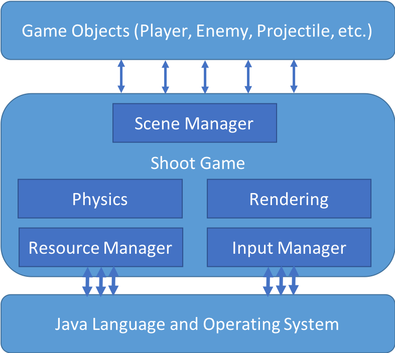

# ShootGame
一个纵版飞行射击游戏

## 游戏名称

未定

## 游戏主题

未定

## 团队信息

### 成员

秦雨轩 何昊 李天翼 缪舜 潘兴禄 王乐强  

### 分工

何昊：游戏的底层实现和架构设计

李天翼：开始，结束和暂停界面的设计，保存和读取游戏功能的实现

王乐强：场景管理器的设计，设计整个游戏关卡

秦雨轩、缪舜、潘兴禄：玩家和敌人类的设计，包括投射物的设计

## 游戏机制

### 玩家设计

主武器：直线射击子弹

技能充能时间较短，伤害较低

技能一：射出一串导弹自动追踪射击敌人（大范围）

技能二：在玩家前方一定距离之外产生一个空爆（隔山打牛）（爆发性伤害）

大招伤害高，充能时间长

大招一：一屏幕子弹（伤害较低但是范围大）

大招二：粗的圆柱形光束（范围小伤害高）

### 敌人设计

#### 敌人一：

HP：一枪就死

武器：没有

体积：小

速度：快

伤害方式：碰到玩家自爆

#### 敌人二：

HP：5（血量适中）

武器：会隔一段时间射出一个子弹

体积：中等

速度：中等

碰到玩家也会自爆并赋予伤害

#### 敌人三：

HP：15（比较高)

武器：既有子弹又会射导弹

体积：大

速度：慢

不流动，只会在画面上方左右晃，碰到玩家什么都不会发生

#### BOSS

HP：非常高

技能：和玩家一样

操作：非常灵活，会根据不同情况做出反应

BOSS仅在上半屏幕活动

#### 投射物

每个设计敌人和玩家的人设计自己的投射物类。

#### 敌人管理器

怎么控制敌人出来

## 游戏画面

### 玩家 

敌人一

敌人二

敌人三

BOSS

### 精灵动画

1. 子弹命中时的爆炸效果（小）
2. 敌人死亡时的爆炸效果（大）

#### 开始界面

单独的JFrame窗体，要有开始，选项，帮助，退出等功能，开始游戏后调出主游戏的JPanel

#### 暂停界面

一个浮在游戏上方的JPanel，提供退出，回到游戏主界面等功能

#### 结束界面

单独的JFrame窗体，显示玩家的分数和杀敌数，评价等信息，点击返回回到开始界面

## 底层架构

负责人：何昊

设计游戏的底层架构是一件非常具有挑战性的事情，因为游戏各个模块之间关联性非常大，稍加不慎代码就会乱成一团。此外，游戏又经常需要往各种五花八门的方向扩展，这就使得我们设计时要非常小心。如果可扩展性太强，则代码难以阅读、维护和编写；但是要是太弱，又使得代码不灵活，新需求出现时常常需要重构。因此我必须寻找一个适合我们需求的平衡点。

考虑到我们游戏实际的实现需求，

### 游戏主循环

### 一些注解

#### 关于成员变量的可访问性

一般来讲，在面向对象的软件设计中，为了良好的封装，都会将成员变量设为`private`并提供`getter()`和`setter()`方法，但是游戏程序中有时并不会这么做，原因如下：

1. 游戏的模块与模块之间耦合度极高，常常出现一个模块大量访问另一个模块的情况，这时使用`getter()`和`setter()`方法会使得代码没有必要地冗长。
2. 由于这种调用非常多，`getter()`和`setter()`会产生可观的函数调用开销，其中尤其致命的是大量地址波动较大的内存访问，是对程序局部性的破坏，降低缓存性能。对于一般应用这种性能损失可以忽略不计，但对性能要求较高的游戏程序则不一定可以忽略。
3. 在Unity等成熟商业游戏引擎中，也存在大量模块直接提供大量`public`成员供程序员直接访问，体现出这是业界的最佳实践。
4. 有的成员变量，即使在外部做了任意修改也不一定会破坏整个游戏的运行正确性。例如，这个变量会在每次游戏主循环中被一段固定代码刷新。

综上所述，本游戏程序的设计中，如果某些变量需要大量修改并且对其修改不会破坏游戏的状态，则会将其暴露为`public`，不提供`getter()`和`setter()`。而对于对游戏状态的正确性确实很敏感的变量，设置为`private`，并且也不提供`getter()`和`setter()`，只允许其他`public`方法更新其值。

#### 关于各种Manager类的作用

使用Manager类是一种常见的代码解耦方式，我们先把代码分成多个层级，例如操作系统层、游戏引擎层和游戏逻辑层。Manager类扮演的作用是将几个层以低耦合的方式连接起来。例如，`ResourceManager`和`InputManager`访问操作系统获取游戏资源和用户输入，供上层游戏逻辑调用。这样做通常有如下的优势：

1. 
2. 

### 参考资料

1. Unity Game Engine.
2. Robert Nystrom. Game Programming Patterns. China Posts & Telecom Press. 2016.
3. Jason Gregory. Game Engine Architecture. Publishing House of Electronic Industry. 2015.